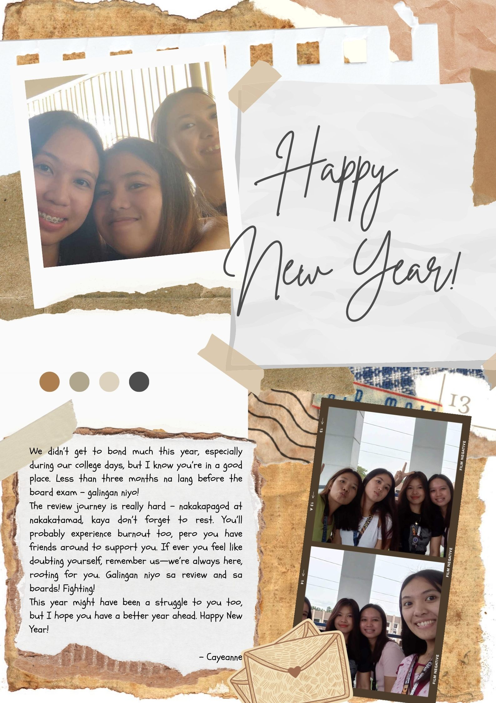

<!DOCTYPE html>
<html lang="en">
<head>
<meta charset="UTF-8">
<title>Gift Reveal Version 2</title>

</head>
<body>

<!-- VIDEO -->

  <video autoplay muted loop>
    <source src="HNY2026.mp4" type="video/mp4">
  </video>

<!-- ENVELOPE -->

  

    

      
    

    

    

      

      

    

  

<!-- PICTURE 1 FULLSCREEN -->

  

</body>
</html>
